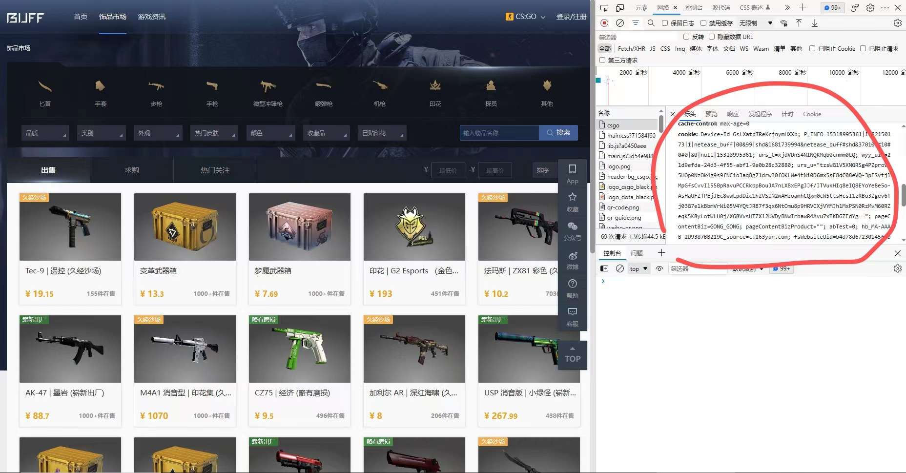
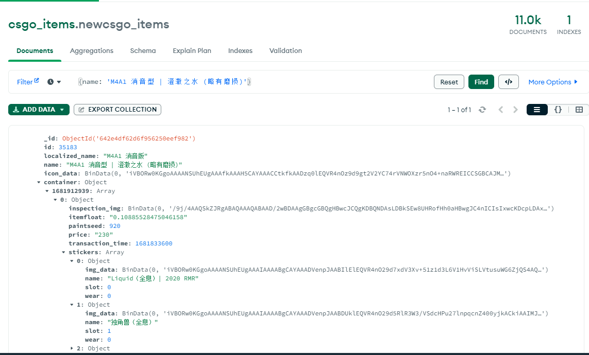

# Buff市场CSGO商品信息获取
这是一个使用Python编写的CSGO物品信息爬虫，使用了Buff交易平台的API。通过输入物品ID，爬虫能够获取该物品的历史交易记录以及所有交易记录的详细信息，如交易时间、价格、饰品磨损度、贴纸等。
| 爬虫 | 前端 | 后端 |
| ------ | ------ | ------ |
| https://github.com/OneMoreLight28th/BuffCrawl  | https://github.com/OneMoreLight28th/BuffCrawlWeb  | https://github.com/OneMoreLight28th/BuffCrawlWebspring |

## 环境要求
- **Python 3.x** 
- **requests**
- **json**
- **pymongo**
- **bson.binary**
- **logging**
- **time**

## 用法
  1.  将物品ID写入到 csgoItemsInfoFixed1.json 文件中，每行一个ID。(图中762238即为id)
  
  2.  在 cookie.txt 文件中输入您的Cookie信息。
  
  3.  运行脚本main.py即可爬取数据并将数据保存到MongoDB数据库中。
  

## 注意事项
- **配置好mongodb环境，注意数据库和集合的名称，在代码中修改**
- **爬取时需要使用有效的Cookie信息才能获取数据，否则会返回错误信息。**
- **在数据量较大时，建议设置适当的延时以避免对Buff服务器的过度请求。**

## 补充
### 2023.5.12 
爬取id的Crawl.py,根据商品门类（weapons_name文件夹中）,爬取该门类下的所有物品id

